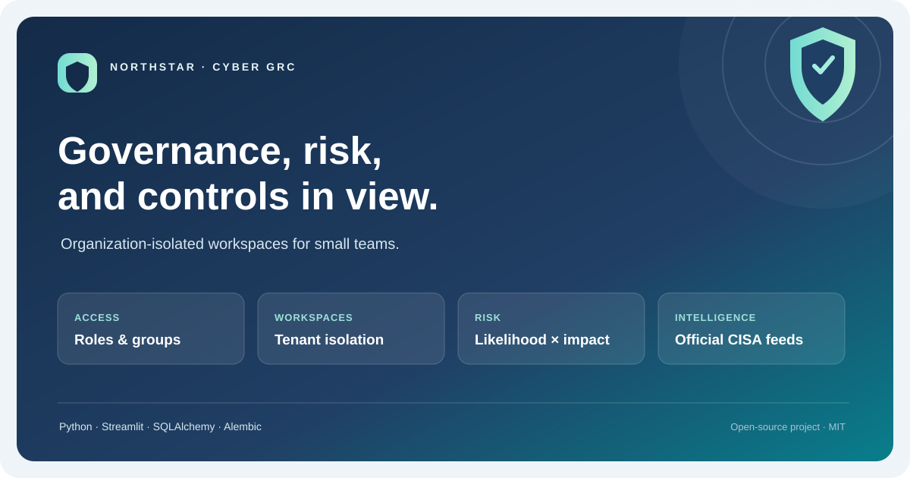
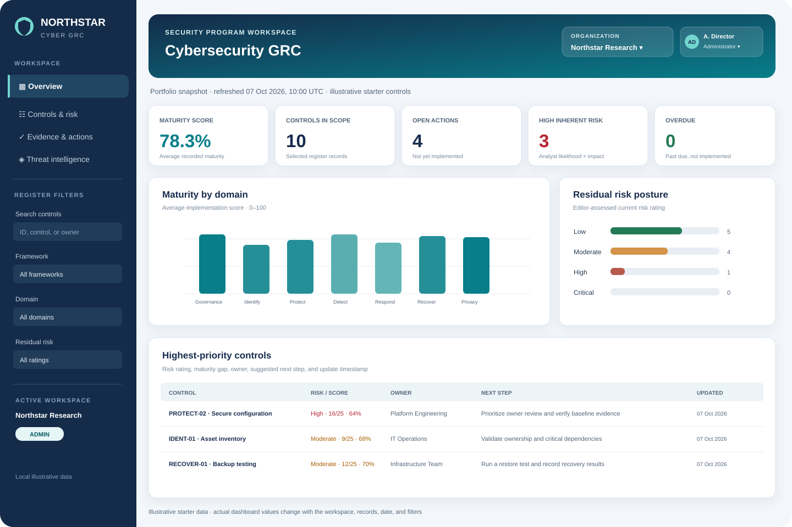
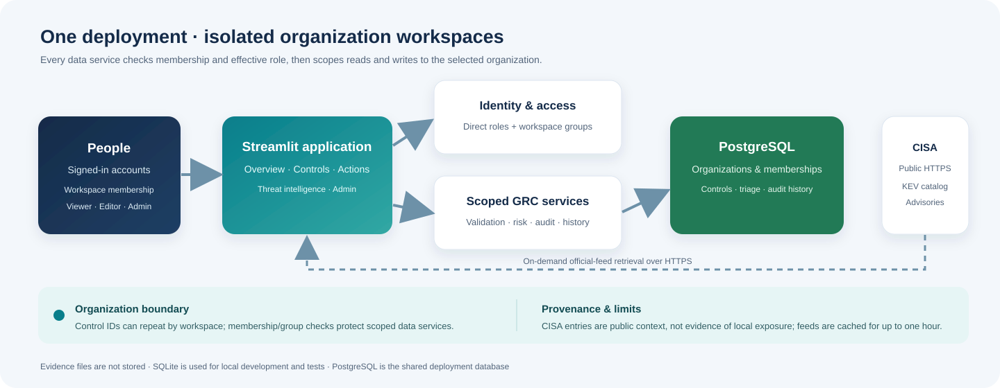

<p align="center">
  
</p>

<h1 align="center">Northstar Cybersecurity GRC Workspace</h1>

<p align="center">
  A practical, single-organization workspace for security controls, risk prioritization, evidence references, and accountable follow-up.
</p>

<p align="center">
  <a href="https://github.com/Huzaifa-Amin/cybersecurity-grc-dashboard/actions/workflows/ci.yml"></a>
  <a href="https://github.com/Huzaifa-Amin/cybersecurity-grc-dashboard/actions/workflows/security.yml"></a>
  
  
  <a href="LICENSE"></a>
</p>

> **Deployment and data boundary:** Northstar is an operational starter, not a certified compliance service or evidence repository. It stores evidence references, not uploaded files. Use approved storage for evidence and deploy this application behind HTTPS on a restricted network.

## At a glance

- **Shared register:** maintain controls, framework mappings, owners, maturity, risk, due dates, evidence references, and notes.
- **Useful oversight:** filter the register, review maturity and framework summaries, prioritize gaps, and export a spreadsheet-safe CSV.
- **Accountability:** provision named accounts, enforce viewer/editor/administrator roles, and review application audit events.
- **Persistent storage:** use PostgreSQL for a shared deployment or SQLite for local development and tests.
- **Report-ready:** consult the project report for the architecture, data tables, workflows, examples, security design, and known limitations.

The intended usage profile is **one organization with fewer than 1,000 registered users**. This is a design target, not a measured capacity, load-test result, or availability guarantee. The included Compose setup runs a single Streamlit instance and a single PostgreSQL database.

## Workspace preview

The illustration uses the bundled starter dataset; dashboard values change with the selected filters and records.

<p align="center">
  
</p>

## Architecture

<p align="center">
  
</p>

### Core records

| Table | What it stores | Practical use |
|---|---|---|
| `controls` | Control identifiers, descriptions, mappings, owner, maturity, risk, dates, evidence references, and notes | The working control and remediation register |
| `users` | Named accounts, password hashes, roles, and account lifecycle state | Authentication and access management |
| `audit_log` | Actor, action, entity, and timestamp for application changes | Administrator review of recent activity |
| `app_settings` | Small application-level settings, including bootstrap state | Safe, one-time first-administrator setup |

Schema changes are versioned with Alembic migrations. Control changes and account lifecycle operations write an audit event in the same database transaction. The audit log is application-level and is **not** tamper-proof or an external immutable audit service.

### Access model

| Role | Read and export | Create / edit controls | Delete controls | Manage users and audit |
|---|:---:|:---:|:---:|:---:|
| Viewer | Yes | No | No | No |
| Editor | Yes | Yes | No | No |
| Administrator | Yes | Yes | Yes | Yes |

Permission checks are enforced by the application, not only by hiding interface controls. Assign each person the minimum role needed. An administrator can provision accounts and set a temporary password; new and reset accounts must change it before using the dashboard.

## Quick start: local use

Requires Python 3.12 or newer. From the repository root, create an environment and install the application dependencies:

```powershell
py -3.12 -m venv .venv
.\.venv\Scripts\Activate.ps1
python -m pip install --upgrade pip
python -m pip install -r requirements.txt
```

Start the app with a local SQLite database and a one-time first-administrator token:

```powershell
$bytes = New-Object byte[] 32
$rng = [System.Security.Cryptography.RandomNumberGenerator]::Create()
$rng.GetBytes($bytes)
$bootstrapToken = [BitConverter]::ToString($bytes).Replace('-', '').ToLower()
$env:BOOTSTRAP_ADMIN_TOKEN = $bootstrapToken
$env:DATABASE_URL = 'sqlite:///./data/grc_dashboard.db'
Write-Host "Bootstrap token (keep private; enter it once in the setup screen): $bootstrapToken"
streamlit run app.py
```

Open [http://127.0.0.1:8501](http://127.0.0.1:8501). Enter the token shown in the terminal on the first-administrator setup screen, then create your administrator account. Keep the token private; it is only needed for initial setup and must not be committed or shared. Once the administrator exists, invite users by creating named accounts in the user-management area.

For deployment configuration, environment variables, and operator guidance, see [Setup](docs/SETUP.md) and the [Runbook](docs/RUNBOOK.md).

## Shared deployment: Docker Compose and PostgreSQL

Docker Engine and the Compose plugin are required. In PowerShell, generate independent secrets and write them to the git-ignored `.env` file:

```powershell
$rng = [System.Security.Cryptography.RandomNumberGenerator]::Create()
$bytes = New-Object byte[] 32
$rng.GetBytes($bytes)
$dbPassword = [BitConverter]::ToString($bytes).Replace('-', '').ToLower()
$rng.GetBytes($bytes)
$bootstrapToken = [BitConverter]::ToString($bytes).Replace('-', '').ToLower()
@("POSTGRES_PASSWORD=$dbPassword", "BOOTSTRAP_ADMIN_TOKEN=$bootstrapToken") |
  Set-Content -Encoding ascii .env
Write-Host "Bootstrap token (keep private; enter it once in the setup screen): $bootstrapToken"
```

Build and start the services:

```powershell
docker compose up --build -d
```

Open [http://127.0.0.1:8501](http://127.0.0.1:8501) and complete first-administrator setup with the printed token. The app port is bound to localhost by default. For remote team access, put the service behind a hardened HTTPS reverse proxy and firewall; do not expose the Streamlit port directly to the public internet.

> **Important:** the CI workflow verifies that the Docker image builds. A live PostgreSQL/Compose deployment, backup-and-restore procedure, and capacity under real user load have not been validated in this environment. Complete those checks in the target hosting environment before production use.

## Hosted deployment

GitHub stores the source code; **GitHub Pages cannot run this interactive app or its database**. A Render Blueprint is provided for hosting the Docker app with PostgreSQL. It requires a Render account connected to this repository and may incur ongoing service and database charges. Review the plan prices before provisioning. Follow the [Render deployment steps](docs/SETUP.md#hosted-deployment-with-render); the hosted workspace starts with a fresh database, so create a new admin account there. Local SQLite accounts/data are not transferred.

## Risk prioritization

The dashboard provides decision support; it does not determine legal compliance or certification. The priority score combines risk severity with the remaining maturity gap:

```text
priority = risk_index * 25 + (100 - status_score)
```

The risk index is 0 for Low, 1 for Moderate, 2 for High, and 3 for Critical. A higher score sorts earlier for attention. Review source assessments, applicability, and treatment decisions with the responsible control owners.

## Security and operating limits

- Passwords are stored as salted PBKDF2-HMAC-SHA-256 hashes. Passwords must be at least 12 characters.
- First-administrator setup uses a one-time bootstrap token. Keep secrets out of source control and rotate them through your deployment process.
- The app uses application-managed accounts; there is no SSO, MFA, invitation email, or self-service password recovery.
- Evidence is a text reference only. Do not upload sensitive evidence files or regulated personal data to this app.
- The starter controls and framework mappings are illustrative. Validate scope, applicability, and mappings against authoritative requirements.
- The deployment is for one organization and a single application instance. It is not a multi-tenant service, and the audit log is not immutable.
- Before production use, configure TLS, network restrictions, backups and restore tests, monitoring, secret rotation, and an incident-response process.

See [Security](SECURITY.md), the [Threat Model](docs/THREAT_MODEL.md), and [Troubleshooting](docs/TROUBLESHOOTING.md) for further detail.

## Project report and documentation

The [print-ready project report](docs/PROJECT_REPORT.html) covers system architecture, database tables, workflows, role matrix, sample records, risk scoring, security controls, deployment, verification, and limitations. Open it in a browser and choose **Print → Save as PDF** to create a shareable report.

| Document | Purpose |
|---|---|
| [Setup guide](docs/SETUP.md) | Local configuration, Docker Compose, and environment variables |
| [Architecture](docs/ARCHITECTURE.md) | Components, data flow, and design boundaries |
| [Runbook](docs/RUNBOOK.md) | Startup, administration, backup considerations, and operational checks |
| [Threat model](docs/THREAT_MODEL.md) | Assets, trust boundaries, threats, mitigations, and residual risk |
| [Verification report](docs/VERIFICATION_REPORT.md) | Test evidence and what remains unverified |
| [Changelog](CHANGELOG.md) | User-facing project changes |

## Development and verification

Install development tools and run the same focused checks used by the repository:

```powershell
python -m pip install -r requirements-dev.txt
python -m pytest -q
ruff check .
black --check .
```

The test suite covers risk summaries, persistence and migrations, validation, account/password lifecycle, access control, audit events, and CSV export. See [docs/VERIFICATION_REPORT.md](docs/VERIFICATION_REPORT.md) for the recorded results and verification boundaries.

## Repository map

```text
app.py                              Streamlit application and role-aware UI
src/grc_dashboard/data.py           Illustrative controls used to seed an empty register
src/grc_dashboard/store.py          Validation, persistence, account lifecycle, audit log
src/grc_dashboard/security.py       Password hashing and role-permission checks
src/grc_dashboard/risk_engine.py    Maturity summaries and risk prioritization
migrations/                         Versioned Alembic schema migrations
tests/                              Risk, persistence, access, and export tests
docs/PROJECT_REPORT.html            Print-ready project report
docs/dashboard-preview.svg          Illustrative dashboard visual
docs/architecture.svg               System architecture infographic
```

## License

Released under the [MIT License](LICENSE).
